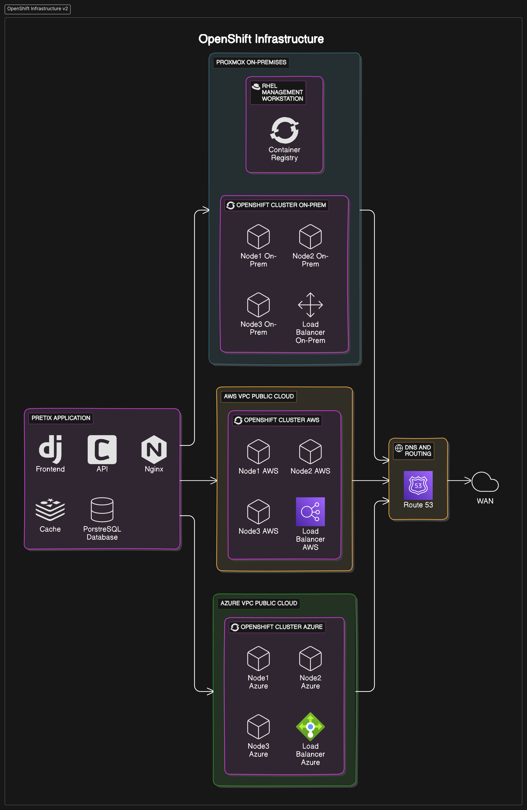

# OpenShift

**WORKSHOPTEAMS 2** (Valentin Bugna, Walid Slimani, Aubry Mangold, Simon Guggisberg)

## POC objectives

Validate the possible use of OpenShift for deploying and managing a multi-tier architecture in a hybrid cloud context to showcase cross-cluster deployments, scaling, and failover capabilities.

## Infra architecture

> TODO: Logical components, ports/protocols, cloud type.

### Diagram

## Scenario

> Describe step-by-step the scenario. Write it using this format (BDD style).

### Summary

The scenario describes the setup of a multi-cloud OpenShift environment. On-premises infrastructure is used to host a an OpenShift cluster. AWS is used to provision an OpenShift cluster, an RDS database and a Route 53 load balancer used for global load balancing and cluster failover. Each cluster is set up with 3 master nodes, 2 worker nodes and a load balancer to route traffic to the nodes.

The open source collaboration platform [Mattermost](https://github.com/mattermost/mattermost) is used to showcase a 2-tier architecture. It consists of an application and a database. The images are stored in a container registry. Route 53 is used for DNS-based failover routing. The application is tested for functionality, load, and failover scenarios.

**Note**: the on-premises infrastructure is simulated using either a local hypervisor (on a laptop at school or in one of the team member's homelab) or a cloud-based hypervisor.

---

### Feature 1: Cluster Setup

#### Task 1: Provision AWS Instances for OpenShift
- **Given** AWS account credentials and appropriate permissions
- **When** EC2 instances for master and worker nodes are provisioned
- **Then** the instances should be ready for OpenShift installation

#### Task 2: Set up Load Balancer for AWS Cluster
- **Given** AWS account credentials and appropriate permissions
- **And** EC2 instances for the OpenShift cluster are provisioned
- **When** an Elastic Load Balancer (ELB) is configured
- **Then** the load balancer should route traffic to the OpenShift master nodes

#### Task 3: Set up OpenShift Cluster on AWS
- **Given** the AWS instances are provisioned
- **And** the load balancer is configured
- **And** the necessary network configuration is in place
- **When** the OpenShift installer is run with the AWS configuration
- **Then** the OpenShift cluster should be successfully deployed on AWS
- **And** the cluster API should be accessible via the load balancer

#### Task 4: Provision On-Premises Infrastructure for OpenShift
- **Given** the on-premises infrastructure is ready with a hypervisor
- **When** virtual machines for master and worker nodes are provisioned
- **Then** the instances should be ready for OpenShift installation

#### Task 6: Set up Load Balancer for On-Premises Cluster
- **Given** the on-premises infrastructure is ready
- **And** the virtual machines are provisioned
- **When** a load balancer is configured (HAProxy)
- **Then** the load balancer should route traffic to the OpenShift master nodes

#### Task 7: Set up OpenShift Cluster On-Premises
- **Given** the on-premises instances are provisioned
- **And** the load balancer is configured
- **And** the necessary network configuration is in place
- **When** the OpenShift installer is run with the on-premises configuration
- **Then** the OpenShift cluster should be successfully deployed on-premises
- **And** the cluster API should be accessible

---

### Feature 2: Multi-Tier Application Setup

#### Task 1: Set Up the RDS database on AWS
- **Given** the AWS infrastructure is ready
- **When** a globally accessible PostgreSQL RDS instance is provisioned
- **Then** the database should be ready for the multi-tier application

#### Task 2: Build and Store Application Images
- **Given** the 2-tier application Docker images are available
- **When** the images are tested with the RDS database and validated
- **Then** the images should be stored on GitHub to be accessible to all clusters

#### Task 3: Create BuildConfig in OpenShift
- **Given** the multi-tier application code is available in a GitHub repository
- **When** a BuildConfig is created in OpenShift
- **Then** OpenShift should be able to build the Docker image from the repository

#### Task 4: Deploy Application to All Clusters
- **Given** the application images are available in the container registry
- **And** the OpenShift clusters are ready
- **When** the application deployment is initiated
- **Then** the application should be successfully deployed on all clusters
- **And** the database should be successfully deployed on the on-premises cluster
- **And** the service should be accessible from all clusters

#### Task 5: Configure Route 53 for DNS-Based Failover
- **Given** Route 53 is available in the AWS account
- **When** a hosted zone is created for the application's domain
- **And** health checks are configured for each cluster's load balancer
- **Then** DNS records should be created with failover routing policies to ensure traffic is redirected to healthy clusters

---

### Feature 3: Testing and Validation

#### Task 1: Verify Application Functionality on AWS
- **Given** the multi-tier application is deployed on the AWS cluster
- **When** functional tests are run against the application on AWS
- **Then** all tests should pass

#### Task 2: Verify Application Functionality On-Premises
- **Given** the multi-tier application is deployed on the on-premises cluster
- **When** functional tests are run against the application on-premises
- **Then** all tests should pass

#### Task 3: Perform Load Testing Across Clusters
- **Given** the multi-tier application is deployed across AWS and on-premises clusters
- **When** load tests are run to simulate high traffic
- **Then** the application should perform optimally and handle the load without issues

#### Task 4: Set Up Cross-Cluster Failover
- **Given** the multi-tier application is deployed across AWS and on-premises clusters
- **When** a cross-cluster failover mechanism (Route 53) is configured
- **Then** the application should continue to be accessible via other clusters if one cluster fails

#### Task 5: Validate Cross-Cluster Failover
- **Given** the cross-cluster failover mechanism is configured
- **When** one of the clusters goes down
- **Then** the application should continue to be accessible through the other clusters
- **And** the failover should be seamless

#### Task 6: Test Autoscaling
- **Given** autoscaling is configured for all clusters
- **When** load tests are performed to increase CPU/memory usage
- **Then** the application should scale out additional pods on all clusters
- **And** the application should scale in when the load decreases

## Cost

> TODO: analysis of load-related costs.

> TODO: option to reduce or adapt costs (practices, subscription)

## Return of experience

> TODO: take a position on the poc that has been produced.

> TODO: did it validate the announced objectives?
