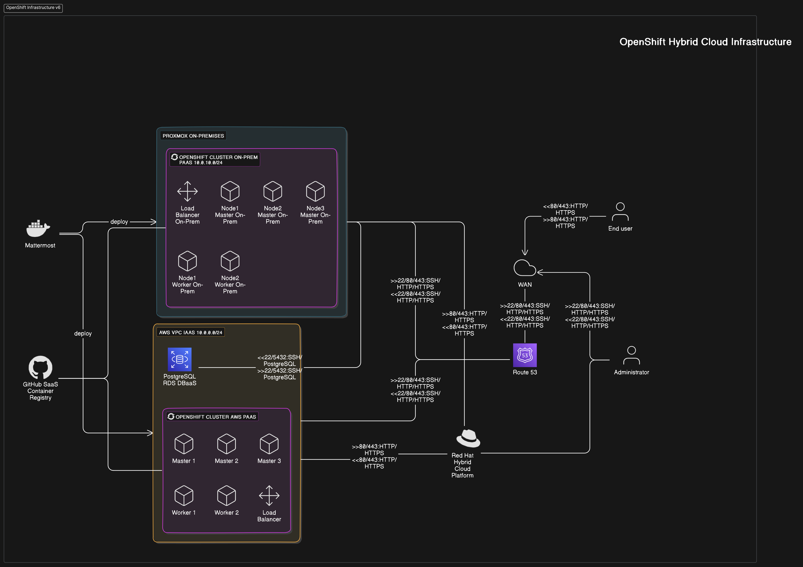

# OpenShift

**WORKSHOPTEAMS 2** (Valentin Bugna, Walid Slimani, Aubry Mangold, Simon Guggisberg)

## POC objectives

Validate the possible use of OpenShift for deploying and managing a multi-tier architecture in a hybrid cloud context to showcase cross-cluster deployments, scaling, and failover capabilities.

## Infra architecture

> TODO: Logical components, ports/protocols, cloud type.

### Diagram

## Scenario

> Describe step-by-step the scenario. Write it using this format (BDD style).

### Summary

The scenario describes the setup of a multi-cloud OpenShift environment. On-premises infrastructure is used to host a RHEL management workstation, a PostgreSQL database, and an OpenShift cluster. AWS is used to provision an OpenShift cluster and a Route 53 load balancer used for cluster failover. The AWS cluster is set up with 5 nodes and a load balancer to route traffic to the nodes. The on-premises cluster is set up with a single OpenShift node.

The open source collaboration platform [Mattermost](https://github.com/mattermost/mattermost) is used to showcase a 2-tier architecture. It consists of an application and a database. The images are stored in a container registry. Route 53 is used for DNS-based failover routing. The application is tested for functionality, load, and failover scenarios.

**Note**: the on-premises infrastructure is simulated using either a local hypervisor (on a laptop at school or in one of the team member's homelab) or a cloud-based hypervisor.

---

### Feature 1: Cluster Setup

#### Task 1: Set Up RHEL Management Workstation on On-Premises Infrastructure
- **Given** the on-premises infrastructure is ready with a hypervisor
- **When** a RHEL management workstation is provisioned
- **Then** the workstation should be configured with necessary tools for managing the OpenShift clusters

#### Task 2: Provision AWS Instances for OpenShift
- **Given** AWS account credentials and appropriate permissions
- **When** EC2 instances for master and worker nodes are provisioned
- **Then** the instances should be ready for OpenShift installation

#### Task 3: Set up Load Balancer for AWS Cluster
- **Given** AWS account credentials and appropriate permissions
- **And** EC2 instances for the OpenShift cluster are provisioned
- **When** an Elastic Load Balancer (ELB) is configured
- **Then** the load balancer should route traffic to the OpenShift master nodes

#### Task 4: Set up OpenShift Cluster on AWS
- **Given** the AWS instances are provisioned
- **And** the load balancer is configured
- **And** the necessary network configuration is in place
- **When** the OpenShift installer is run with the AWS configuration
- **Then** the OpenShift cluster should be successfully deployed on AWS
- **And** the cluster API should be accessible via the load balancer

#### Task 5: Provision On-Premises Infrastructure for OpenShift
- **Given** the on-premises infrastructure is ready with a hypervisor
- **When** a virtual machine is provisioned
- **Then** the instance should be ready for OpenShift installation

#### Task 6: Set up OpenShift Cluster On-Premises
- **Given** the on-premises instances are provisioned
- **And** the necessary network configuration is in place
- **When** the OpenShift installer is run with the on-premises configuration
- **Then** the OpenShift cluster should be successfully deployed on-premises
- **And** the cluster API should be accessible

---

### Feature 2: Multi-Tier Application Setup

#### Task 1: Set Up PostgreSQL on RDS
- **Given** an AWS account with appropriate permissions
- **When** a PostgreSQL database is provisioned on RDS
- **Then** the database should be accessible by the multi-tier application

#### Task 2: Build and Store Application Images
- **Given** the multi-tier application source code
- **And** Dockerfiles for building the application images
- **When** the images are built using the Dockerfiles
- **Then** the images should be stored in a container registry accessible to all clusters

#### Task 3: Create BuildConfig in OpenShift
- **Given** the multi-tier application code is available in a Git repository
- **When** a BuildConfig is created in OpenShift
- **Then** OpenShift should be able to build the Docker image from the repository

#### Task 4: Deploy Application Tiers to All Clusters
- **Given** the application images are available in the container registry
- **And** the OpenShift clusters are ready
- **When** the application deployment is initiated
- **Then** the application should be successfully deployed on all clusters
- **And** the database should be successfully deployed on the on-premises cluster
- **And** the service should be accessible from all clusters

#### Task 5: Configure Route 53 for DNS-Based Failover
- **Given** Route 53 is available in the AWS account
- **When** a hosted zone is created for the application's domain
- **And** health checks are configured for each cluster's load balancer
- **Then** DNS records should be created with failover routing policies to ensure traffic is redirected to healthy clusters

---

### Feature 3: Testing and Validation

#### Task 1: Verify Application Functionality on AWS
- **Given** the multi-tier application is deployed on the AWS cluster
- **When** functional tests are run against the application on AWS
- **Then** all tests should pass

#### Task 2: Verify Application Functionality On-Premises
- **Given** the multi-tier application is deployed on the on-premises cluster
- **When** functional tests are run against the application on-premises
- **Then** all tests should pass

#### Task 3: Perform Load Testing Across Clusters
- **Given** the multi-tier application is deployed across AWS and on-premises clusters
- **When** load tests are run to simulate high traffic
- **Then** the application should perform optimally and handle the load without issues

#### Task 4: Validate Cross-Cluster Failover
- **Given** the cross-cluster failover mechanism is configured
- **When** one of the clusters goes down
- **Then** the application should continue to be accessible through the other clusters
- **And** the failover should be seamless

#### Task 5: Test Autoscaling
- **Given** autoscaling is configured for all clusters
- **When** load tests are performed to increase CPU/memory usage
- **Then** the application should scale out additional pods on all clusters
- **And** the application should scale in when the load decreases

## Cost Analysis

> TODO: analysis of load-related costs.

This analysis covers the cost components involved in setting up a multi-cloud OpenShift environment using on-premises infrastructure and AWS. Because we couldn't set up Mattermost, we can't provide a precise cost analysis that includes autoscaling. But because we're using an OpenShift cluster, the cost of autoscaling would be based on the number of instances the cluster uses.

The instances and resources used in the AWS cluster are the following:

| **Instance Type** | **vCPUs** | **RAM (GiB)** | **Cost per Hour** | **Number of Instances** |
|-------------------|-----------|---------------|-------------------|-------------------------|
| m5.2xlarge        | 8         | 32            | $0.384            | 3                       |
| m5a.xlarge        | 4         | 16            | $0.172            | 2                       |
| r5.xlarge         | 4         | 32            | $0.376            | 2                       |

### Total Specs of EC2 Instances
- **vCPUs**: 40 vCPUs
- **RAM**: 192 GiB

We'll estimate the cost of the Proxmox server based on the vCPU and RAM used by the AWS instances. A server, or rather multiple servers with a capacity of 192 GiB of RAM and 40 vCPUs would equate to 3 high-end servers with 64 GiB of RAM and 16 vCPUs each. Assuming we're buying new HPE ProLiant Gen11 servers with appropriate specs, the cost would be around $4,200 per server. We'll assume we're buying 3 servers for a total of $12,600.

### Cost Breakdown

**1. On-Premises Infrastructure**

- **Proxmox Servers**: 
  - **Proxmox Servers**: 3 * $4200 = $12,600 (one-time cost)
  - **Cost**: $12,600 (upfront)
  - **Internet Costs**: $200 per month
  - **Electricity Costs**: $20 per day (estimated $600 per month)
  - **Total Cost per Month**: $200 + $600 = $800

**2. AWS Infrastructure**

- **EC2 Instances for OpenShift Cluster**
  - **Instance Types and Costs**:
    - **m5.2xlarge**: $0.384 per hour
    - **m5a.xlarge**: $0.172 per hour
    - **r5.xlarge**: $0.376 per hour
  - **Number of Instances**:
    - **m5.2xlarge**: 3 instances
    - **m5a.xlarge**: 2 instances
    - **r5.xlarge**: 2 instances

  - **Total Monthly Costs**:
    - **m5.2xlarge**: 3 instances * $0.384/hour * 24 hours/day * 30 days/month = $829.44
    - **m5a.xlarge**: 2 instances * $0.172/hour * 24 hours/day * 30 days/month = $247.68
    - **r5.xlarge**: 2 instances * $0.376/hour * 24 hours/day * 30 days/month = $541.44

  - **Total EC2 Cost per Month**: $829.44 + $247.68 + $541.44 = $1,618.56

- **Elastic Load Balancer**
  - **Cost**: $0.0455 per hour
  - **Total Cost per Month**: $0.0455/hour * 24 hours/day * 30 days/month = $32.76

- **Elastic IPs**
  - **Cost**: $0.005 per hour (2 IPs)
  - **Total Cost per Month**: 2 IPs * $0.005/hour * 24 hours/day * 30 days/month = $7.20

- **RDS for PostgreSQL**
  - **Instance Type**: db.t3.medium (example, we were using the free tier)
  - **Cost**: $0.0416 per hour
  - **Total Cost per Month**: $0.0416/hour * 24 hours/day * 30 days/month = $29.95

- **Route 53**
  - **Hosted Zone Cost**: $0.50 per zone per month
  - **DNS Queries**: $0.40 per million queries (we assume max 1 million queries per month for simplicity, actual costs may vary based on actual traffic)
  - **Total Cost per Month**: $0.50 + $0.40 = $0.90

#### Total Monthly and Upfront Costs

| **Cost Component**                    | **Upfront Cost** | **Monthly Cost** |
|---------------------------------------|------------------|------------------|
| Proxmox Servers                       | $12,600          | $0               |
| Internet and Electricity Costs        | $0               | $800             |
| AWS EC2 Instances                     | $0               | $1,618.56        |
| AWS Elastic Load Balancer             | $0               | $32.76           |
| AWS Elastic IPs (2)                   | $0               | $7.20            |
| AWS RDS for PostgreSQL                | $0               | $29.95           |
| AWS Route 53                          | $0               | $0.90            |
| **Total**                             | **$12,600**      | **$2489.37**    |

#### Other Considerations

- **Licensing**: Costs for any required software licenses (RHEL, OpenShift) are not included and should be considered. The costs may vary based on the licensing model and the number of nodes.
- **Ongoing costs**: Costs for support and maintenance for both infrastructures.

### Cost Reduction Strategies

> TODO: option to reduce or adapt costs (practices, subscription)

To reduce costs, the following strategies could be considered:

- **Reserved/spot Instances and IPs**: Purchase reserved or spot instances and IPs for the AWS cluster to reduce costs. This is a good strategy for instances that are running 24/7 such as an OpenShift cluster.
- **Optimize resource usage**: Use less nodes or smaller instances if possible to reduce costs. Set up autoscaling to add and removes nodes only when needed.
- **Use free tier services**: Use free tier services where possible to reduce costs. For example, we used the free tier for RDS and it might be possible to use smaller instances for temporary needs such as when quickly scaling.
- **Connect the clusters directly**: Split the nodes between the two clusters to reduce the number of nodes needed in each cluster. This will reduce the number of instances needed and thus reduce costs. On the down side, this will increase the complexity of the setup and the remaining cluster will be seriously impacted if one of the clusters goes down.

## Return of experience

> TODO: take a position on the poc that has been produced.

The first feature of the scenario `Feature 1: Cluster Setup` was successfully implemented. After reading the documentation and gathering the necessary IAM roles thanks to our administrator, we were able to provision our AWS infrastructure. The provisioning of the on-premises OpenShift infrastructure was more complicated because of limited resources compared to AWS. The local hypervisor was limited to 64GB of RAM and 16 vCPUs, which was not enough to run the OpenShift cluster installer. In the end, we resorted to using a single-node cluster as described by RedHat.

Due to technical limitations of the on-premises environment (namely the unavailability of certains ports), we had to set up a reverse proxy to access the OpenShift console and applications. Due to SSL issues, we were unable to access the console and applications from the WAN (we always get `502 Bad Gateway` errors). As a workaround, we've set up a VPN that allows us to interact with the on-premises server. The AWS cluster is accessible from the WAN.

The second feature of the scenario `Feature 2: Multi-Tier Application Setup` was not implemented due to the accumulation of errors and the lack of time. We were able to set up the PostgreSQL database on RDS correctly and set up an `Openshift` image [on GitHub](https://github.com/users/GuggisbergSimon/packages/container/mattermost/229200981?tag=openshiftv2). We had trouble storing the application images in the container registry, and accessing our volumes. Ultimately, the pods are stuck in `Init:CrashLoopBackOff` state and we were unable to access the application.

Because of this, we were unable to test the application's functionality, perform load testing, or validate cross-cluster failover. We were also unable to test autoscaling. The lack of a working application prevented us from validating the failover mechanism and autoscaling.

The DNS configuration was set up on Route 53 for both clusters. Because the application was not working, we were unable to set up the failover mechanism.

Both clusters were linked in the Red-Hat Hybrid Cloud Console.

The last feature of the scenario, namely testing, wasn't done due to the lack of a working application. We were unable to verify the application's functionality on AWS or on-premises, perform load testing, or validate cross-cluster failover. We were also unable to test autoscaling.

The proof-of-concept validates that it is possible to setup two independent OpenShift clusters on-premises and in AWS, but not that we can do HA between them using Route53. We were unable to validate the application deployment and the failover mechanism due to technical issues. The cost analysis was done based on the resources used in the scenario.

> TODO: did it validate the announced objectives?

The proof of concept did not validate the entirety of the objectives because of lack of time and many unforseen problems. The application was not working, which prevented us from testing the failover mechanism and autoscaling. The lack of a working application also prevented us from testing the application's functionality and performing load testing. It did however validate the setup of two independent OpenShift clusters on-premises and in AWS.

